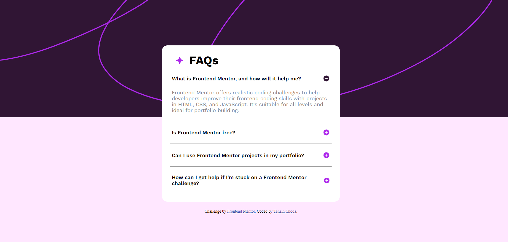
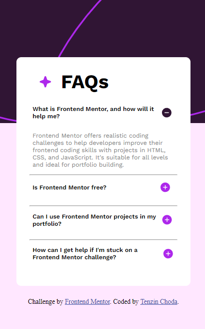

# Frontend Mentor - FAQ accordion solution

This is a solution to the [FAQ accordion challenge on Frontend Mentor](https://www.frontendmentor.io/challenges/faq-accordion-wyfFdeBwBz). Frontend Mentor challenges help you improve your coding skills by building realistic projects. 

## Table of contents

- [Overview](#overview)
  - [The challenge](#the-challenge)
  - [Screenshot](#screenshot)
  - [Links](#links)
- [My process](#my-process)
  - [Built with](#built-with)
  - [What I learned](#what-i-learned)
  - [Continued development](#continued-development)
- [Author](#author)
- [Acknowledgments](#acknowledgments)

## Overview
In this project i have designed an accordion for frequently asked questions (FAQs), which almost matches the design provided by frontend mentor. It was a bit challenging especially while emplementing the dynamics in javascript, I really enjoyed doing the project.

### The challenge

Users should be able to:

- Hide/Show the answer to a question when the question is clicked
- Navigate the questions and hide/show answers using keyboard navigation alone
- View the optimal layout for the interface depending on their device's screen size
- See hover and focus states for all interactive elements on the page

### Screenshot
You can view the screenshots of my work below.😊

### Links

- Solution URL: [Add solution URL here](https://your-solution-url.com)
- Live Site URL: https://tenze21.github.io/FAQ-Accordion-frontend-mentor/

## My process
firstly as i usually do i went through the challenge and spend sometime trying to recreate a the project in my mind asking myself how I would make things work. Then i started off with the html file later styling it with css and then finally implenting the dynamics in javascript which took a while for me.

### Built with

- Semantic HTML5 markup
- CSS custom properties
- Flexbox
- desktop-first workflow

### What I learned

As with all projects I learned a lot from this project especially in implementing the dynamic logic which was the most challenging and interesting part for me. I realised that i could use conditional statements to check how a code block was styled and make it function accordingly.

`function showHideAnswer1(){
    if(show1.style.display==='block'){
        ans1.style.display='none';
    }else{
        ans1.style.display='block';
    }
}`

### Continued development

some animation effects could be added when the answer is viewed in the FAQ accordion to make it more interactive. 

## Author

- Website - [Tenzin Choda](https://www.your-site.com)
- Frontend Mentor - [@tenze21](https://www.frontendmentor.io/profile/yourusername)

## Acknowledgments

I am greateful to the frontend mentor team for the exciting projects.

